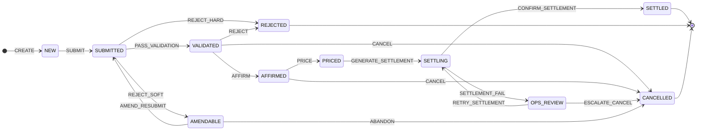

# ETF Order Workflow — Creation/Redemption Lifecycle

## Overview

This workflow models the institutional ETF Creation/Redemption (C/R) order lifecycle as operated between an **Authorized Participant (AP)** and an **ETF Issuer**. It covers the full journey from order submission through gateway validation, issuer affirmation, end-of-day NAV pricing, and DTC/NSCC settlement — including amendment loops and settlement failure handling.

The workflow is defined as a Mermaid statechart and seeded into the backend engine, which dynamically generates typed REST API endpoints for each trigger.

---

## State Diagram



```
NEW → SUBMITTED → VALIDATED → AFFIRMED → PRICED → SETTLING → SETTLED
         │            │           │                    │
     REJECT_SOFT    REJECT      CANCEL            SETTLE_FAIL
         ↓            ↓           ↓                    ↓
     AMENDABLE     REJECTED   CANCELLED           OPS_REVIEW
      ↙     ↘                                     ↙      ↘
  RESUBMIT  ABANDON                           RETRY   ESCALATE
      ↓        ↓                                ↓         ↓
  SUBMITTED CANCELLED                       SETTLING  CANCELLED
```

---

## States

### Lifecycle States (Happy Path)

| State | Label | Description |
|-------|-------|-------------|
| **NEW** | NEW | Order created. The AP has filled in the order form (action, ticker, units, method, basket type). This is the initial state — the instance exists but has not yet been submitted to the gateway. In the frontend, the create form auto-fires the SUBMIT trigger immediately, so orders typically pass through NEW in under a second. |
| **SUBMITTED** | SENT | Order submitted to the validation gateway. Automated pre-trade checks are running: KYC verification, credit limit check, creation unit size validation, cutoff time check, AP authorization verification. The order is now in the system but not yet approved. |
| **VALIDATED** | VALD | All gateway checks passed. The order is valid and forwarded to the ETF issuer for review. The issuer can affirm (accept), reject, or the AP can cancel before affirmation. |
| **AFFIRMED** | AFRM | The ETF issuer has affirmed the order — this establishes a **binding contract**. The order is now locked: units, basket composition, and delivery method are fixed. The order awaits end-of-day NAV pricing. The AP can still cancel before the NAV is struck, but this may incur penalties. |
| **PRICED** | PRCD | The end-of-day NAV has been struck. The fund accounting system has calculated the final NAV per share, gross trade value, cash component, transaction fees, and net settlement amount. Settlement instructions can now be generated. This is a point of no return — the order cannot be cancelled after pricing. |
| **SETTLING** | STLG | Settlement instructions have been generated and sent to DTC/NSCC (US) or the relevant CSD. The custodian is processing the Delivery vs. Payment (DVP) — the AP delivers the securities basket (in-kind) or cash, and receives ETF shares (creation) or vice versa (redemption). |
| **SETTLED** | DONE | DVP completed. For a creation: the AP has delivered the basket and received newly issued ETF shares. For a redemption: the AP has returned ETF shares and received the underlying securities basket. Cash components have been settled via Fedwire or DTC. Shares outstanding have been updated. **Terminal state.** |

### Exception States

| State | Label | Description |
|-------|-------|-------------|
| **AMENDABLE** | AMND | The order received a **soft rejection** — the issue is fixable. Common reasons: unit size below minimum, invalid basket version, missing optional fields, stale PCF reference. The AP can amend the order and resubmit, or abandon it entirely. This creates a loop back to SUBMITTED. |
| **OPS_REVIEW** | OPS | Settlement has failed and requires **manual intervention** by the operations desk. Common failure types: counterparty can't deliver the full basket, DTC instruction rejected, cash shortfall, partial delivery with outstanding fails. Ops can retry the settlement after resolving the issue, or escalate to cancellation if the failure is unrecoverable. |

### Terminal States

| State | Label | Description |
|-------|-------|-------------|
| **REJECTED** | REJ | Order permanently rejected. Two paths lead here: (1) **Hard rejection** from the gateway — fatal validation failure such as invalid AP credentials, unauthorized access, or compliance block. (2) **Issuer rejection** — the issuer declines the order due to inventory shortage, cutoff missed, or price disagreement. No further actions are possible. |
| **CANCELLED** | CXLD | Order cancelled. Can occur from multiple states: (1) AP cancels from VALIDATED or AFFIRMED (before pricing). (2) AP abandons an amendable order. (3) Ops desk escalates an unrecoverable settlement failure. Cancellation reasons are recorded in the order context for audit. |

---

## Triggers

### Happy Path Triggers

| Trigger | From → To | Who Fires | Description |
|---------|----------|-----------|-------------|
| **CREATE** | [*] → NEW | AP (frontend) | Creates the order instance with initial context: action (CREATE/REDEEM), ticker, units, unit size, settlement method, basket type. |
| **SUBMIT** | NEW → SUBMITTED | AP (frontend, auto-fired) | Submits the order to the validation gateway. Uses the same payload as CREATE — the frontend fires both in a single click (auto-submit collapse pattern). |
| **PASS_VALIDATION** | SUBMITTED → VALIDATED | Gateway (system) | All pre-trade validation checks passed. In production this would be fired by an automated validation engine; in the prototype it's a manual action button. |
| **AFFIRM** | VALIDATED → AFFIRMED | Issuer | The ETF issuer affirms the order. Optionally includes the affirming party, estimated cash amount, and pricing method (NAV_NEXT or FIXED_NAV). |
| **PRICE** | AFFIRMED → PRICED | Fund Accounting (system) | End-of-day NAV struck. Payload includes nav_date, nav_per_unit, gross_trade_value, cash_component, and net_settlement_amount. In production this would be fired by the fund accounting system after market close. |
| **GENERATE_SETTLEMENT** | PRICED → SETTLING | Operations | Settlement instructions generated and dispatched to DTC/custodian. Payload includes the DTC instruction ID and expected settlement date. |
| **CONFIRM_SETTLEMENT** | SETTLING → SETTLED | Custodian/DTC (system) | DVP completed. Payload includes settlement reference, depository (DTC, NSCC_CNS, EUROCLEAR, CREST), and confirmed settlement date. |

### Rejection & Amendment Triggers

| Trigger | From → To | Who Fires | Description |
|---------|----------|-----------|-------------|
| **REJECT_SOFT** | SUBMITTED → AMENDABLE | Gateway | Validation found a fixable issue. The AP can amend and resubmit. Payload includes the amendment reason. |
| **REJECT_HARD** | SUBMITTED → REJECTED | Gateway | Fatal validation failure — order cannot proceed. Payload includes reject reason and optional reject code (INVALID_AP, CUTOFF_MISSED, CREDIT_BREACH). |
| **REJECT** | VALIDATED → REJECTED | Issuer | Issuer declines the order. Payload includes reject reason and optional code (INVENTORY_SHORTAGE, CUTOFF_MISSED, PRICE_DISAGREEMENT). |
| **AMEND_RESUBMIT** | AMENDABLE → SUBMITTED | AP | AP has corrected the issues identified in the soft rejection and resubmits. The order re-enters the validation pipeline. |
| **ABANDON** | AMENDABLE → CANCELLED | AP | AP decides not to fix the order and abandons it. |

### Settlement Exception Triggers

| Trigger | From → To | Who Fires | Description |
|---------|----------|-----------|-------------|
| **SETTLEMENT_FAIL** | SETTLING → OPS_REVIEW | Custodian/DTC (system) | Settlement failed. Payload includes fail reason and fail type (COUNTERPARTY_FAIL, BASKET_INCOMPLETE, DTC_REJECT, CASH_SHORTFALL). |
| **RETRY_SETTLEMENT** | OPS_REVIEW → SETTLING | Operations | Ops desk has resolved the issue and retries settlement. |
| **ESCALATE_CANCEL** | OPS_REVIEW → CANCELLED | Operations | Settlement failure is unrecoverable — ops desk escalates to cancellation. |

### Cancellation Triggers

| Trigger | From → To | Who Fires | Description |
|---------|----------|-----------|-------------|
| **CANCEL** | VALIDATED → CANCELLED | AP | AP cancels the order before issuer affirmation. No penalties. |
| **CANCEL** | AFFIRMED → CANCELLED | AP | AP cancels after affirmation but before NAV pricing. May incur penalties per the AP agreement. |

---

## Payload Schemas

Each trigger accepts a JSON payload. Fields marked `required` must be present; `optional` fields enrich the order context but are not mandatory. The payloads are defined in the Mermaid note blocks and can drive future dynamic form generation in the frontend.

### CREATE / SUBMIT

```json
{
  "action":            "CREATE",        // required: CREATE or REDEEM
  "ticker":            "SPY",           // required: ETF ticker symbol
  "units":             2,               // required: number of creation/redemption units
  "unit_size":         50000,           // required: shares per unit
  "method":            "Cash",          // required: Cash or In-Kind
  "basket_type":       "Standard",      // required: Standard or Custom
  "settlement_period": "T1",            // optional: T0, T1, or T2
  "ap_account_id":     "AP-GS-001"     // optional: AP's account identifier
}
```

### PASS_VALIDATION

```json
{
  "validation_id":    "VAL-20260320-001",
  "checks_passed":    ["KYC", "CREDIT_LIMIT", "UNIT_SIZE", "CUTOFF", "AP_AUTH"]
}
```

### AFFIRM

```json
{
  "affirmed_by":            "issuer_desk_1",
  "estimated_cash_amount":  125000.00,
  "pricing_method":         "NAV_NEXT"
}
```

### PRICE

```json
{
  "nav_date":              "2026-03-20",
  "nav_per_unit":          571.82,
  "gross_trade_value":     57182000.00,
  "cash_component":        12450.00,
  "net_settlement_amount": 57194450.00
}
```

### GENERATE_SETTLEMENT

```json
{
  "dtc_instruction_id":  "DTC-20260320-047",
  "settlement_date":     "2026-03-22"
}
```

### CONFIRM_SETTLEMENT

```json
{
  "settlement_ref":  "SREF-20260322-001",
  "depository":      "DTC",
  "settled_date":    "2026-03-22"
}
```

### REJECT_SOFT

```json
{
  "amendment_reason":  "Unit size below fund minimum (25,000)",
  "amended_fields":    "units, unit_size"
}
```

### REJECT_HARD / REJECT

```json
{
  "reject_reason":  "AP authorization expired",
  "reject_code":    "INVALID_AP"
}
```

Reject codes: `INVALID_AP`, `CUTOFF_MISSED`, `CREDIT_BREACH`, `INVENTORY_SHORTAGE`, `PRICE_DISAGREEMENT`

### SETTLEMENT_FAIL

```json
{
  "fail_reason":  "Counterparty unable to deliver full basket — 3 constituents outstanding",
  "fail_type":    "BASKET_INCOMPLETE"
}
```

Fail types: `COUNTERPARTY_FAIL`, `BASKET_INCOMPLETE`, `DTC_REJECT`, `CASH_SHORTFALL`

### CANCEL / ABANDON / ESCALATE_CANCEL

```json
{
  "cancel_reason":  "AP withdrew request — market conditions changed",
  "cancelled_by":   "trader_jd"
}
```

---

## Frontend Integration

### Order Entry Form → CREATE + SUBMIT

The order entry panel on the left sidebar maps directly to the CREATE/SUBMIT payload:

| Form Field | Payload Field | Type |
|-----------|--------------|------|
| CREATE / REDEEM toggle | `action` | Enum: CREATE, REDEEM |
| ETF Ticker dropdown | `ticker` | Enum: SPY, QQQ, IWM, ... |
| Units input | `units` | Integer |
| Unit Size input | `unit_size` | Integer |
| Method dropdown | `method` | Enum: Cash, In-Kind |
| Basket Type dropdown | `basket_type` | Enum: Standard, Custom |

When the user clicks **SUBMIT ORDER**, the frontend:
1. Creates the instance via `POST /api/state-machines/instances` (→ NEW state)
2. Immediately fires `POST /api/etf_order/{id}/SUBMIT` with the same payload (→ SUBMITTED state)

This is the **auto-submit collapse pattern** — one click, two operations, the user sees the order appear in the blotter as SENT.

### Order Blotter → Status Display

The blotter polls `GET /api/state-machines/instances?workflow_name=etf_order` every 3 seconds and maps states to display labels:

| Backend State | Blotter Label | Color |
|--------------|--------------|-------|
| NEW | NEW | Gray |
| SUBMITTED | SENT | Blue |
| VALIDATED | VALD | Blue |
| AFFIRMED | AFRM | Green |
| PRICED | PRCD | Green |
| SETTLING | STLG | Blue |
| SETTLED | DONE | Green |
| AMENDABLE | AMND | Yellow |
| OPS_REVIEW | OPS | Yellow |
| REJECTED | REJ | Red |
| CANCELLED | CXLD | Red |

### Order Detail Panel → Action Buttons

Clicking a blotter row opens the detail panel, which shows action buttons for `available_events` returned by the backend. Each trigger has a labeled, color-coded button:

| Trigger | Button Label | Color | Category |
|---------|-------------|-------|----------|
| SUBMIT | Submit | Blue | — |
| PASS_VALIDATION | Pass Validation | Blue | Happy path |
| AFFIRM | Affirm | Green | Happy path |
| PRICE | Strike NAV | Green | Happy path |
| GENERATE_SETTLEMENT | Gen. Settlement | Blue | Happy path |
| CONFIRM_SETTLEMENT | Confirm Settle | Green | Happy path |
| REJECT_SOFT | Soft Reject | Yellow | Exception |
| REJECT_HARD | Hard Reject | Red | Exception |
| REJECT | Reject | Red | Exception |
| SETTLEMENT_FAIL | Settle Failed | Red | Exception |
| RETRY_SETTLEMENT | Retry Settle | Blue | Recovery |
| ESCALATE_CANCEL | Escalate Cancel | Red | Recovery |
| AMEND_RESUBMIT | Amend & Resubmit | Yellow | Amendment |
| ABANDON | Abandon | Red | Amendment |
| CANCEL | Cancel | Red | Cancellation |

**Current limitation:** Action buttons fire triggers with empty payloads. Triggers with optional payload fields work correctly (the context is enriched incrementally). A future enhancement will generate dynamic forms from the Mermaid note block payload schemas, prompting the user for required fields before firing.

---

## Lifecycle Scenarios

### Scenario 1: Happy Path (Creation)

```
AP fills form: CREATE SPY, 2 units × 50,000 shares, Cash, Standard
  → [CREATE]  Instance created in NEW
  → [SUBMIT]  Auto-fired → SUBMITTED
  → [PASS_VALIDATION]  Gateway: KYC ✓, credit ✓, unit size ✓, cutoff ✓, AP auth ✓ → VALIDATED
  → [AFFIRM]  Issuer desk affirms → AFFIRMED
  → [PRICE]   4:00 PM NAV strike: $571.82/unit → PRICED
  → [GENERATE_SETTLEMENT]  DTC instruction sent → SETTLING
  → [CONFIRM_SETTLEMENT]   DVP completed T+1 → SETTLED ✓
```

### Scenario 2: Soft Rejection → Amendment → Success

```
AP submits: CREATE IWM, 500 units × 10,000 shares
  → SUBMITTED
  → [REJECT_SOFT]  "Unit size 10,000 below fund minimum 25,000" → AMENDABLE
  → [AMEND_RESUBMIT]  AP corrects to 25,000 → SUBMITTED
  → [PASS_VALIDATION]  → VALIDATED
  → [AFFIRM]  → AFFIRMED
  → ... (continues to SETTLED)
```

### Scenario 3: Issuer Rejection

```
AP submits: REDEEM TLT, 100 units
  → SUBMITTED → VALIDATED
  → [REJECT]  Issuer: "Inventory shortage — insufficient TLT holdings" → REJECTED ✗
```

### Scenario 4: Settlement Failure → Ops Retry → Success

```
Order reaches SETTLING
  → [SETTLEMENT_FAIL]  "Counterparty can't deliver 3 basket constituents" → OPS_REVIEW
  → Ops desk contacts counterparty, resolves fails
  → [RETRY_SETTLEMENT]  → SETTLING
  → [CONFIRM_SETTLEMENT]  → SETTLED ✓
```

### Scenario 5: Settlement Failure → Escalate Cancel

```
Order reaches SETTLING
  → [SETTLEMENT_FAIL]  "DTC rejected instruction — invalid participant ID" → OPS_REVIEW
  → Ops determines AP's DTC membership lapsed
  → [ESCALATE_CANCEL]  "Unrecoverable: AP DTC membership expired" → CANCELLED ✗
```

### Scenario 6: AP Cancels Before Pricing

```
AP submits: CREATE QQQ, 5 units
  → SUBMITTED → VALIDATED
  → [CANCEL]  "Market conditions changed — AP no longer wants exposure" → CANCELLED ✗
```

---

## Real-World Mapping

This workflow maps to the real ETF C/R process as follows:

| Workflow State | Real-World Equivalent | Systems Involved |
|---------------|----------------------|-----------------|
| NEW | AP fills order in issuer portal | AP Portal / ETF Order Hub |
| SUBMITTED | Order sent to validation gateway | Gateway validation engine, compliance |
| VALIDATED | Pre-trade checks passed | KYC system, credit risk, fund rules engine |
| AFFIRMED | Issuer confirms — binding contract | Issuer OMS, Transfer Agent |
| PRICED | EOD NAV struck by fund accounting | Fund Accounting System (SimCorp, Advent Geneva) |
| SETTLING | DTC/NSCC instructions dispatched | Custodian, DTCC DTC, NSCC Fund/SERV |
| SETTLED | DVP completed, shares issued/cancelled | DTC, Transfer Agent, fund share registry |
| AMENDABLE | Soft reject — fixable validation issue | AP Portal (amendment workflow) |
| OPS_REVIEW | Settlement fail — manual intervention | Middle/back office operations desk |
| REJECTED | Fatal reject (gateway or issuer) | Compliance, issuer risk management |
| CANCELLED | Order withdrawn or unrecoverable fail | All systems — state propagated |

### Simplifications in the Prototype

The prototype makes several simplifications compared to a production C/R system:

1. **No PCF handling** — Production systems validate the order against the day's Portfolio Composition File (PCF). The prototype skips basket composition validation.
2. **No real NAV calculation** — The PRICE trigger accepts manual NAV input. In production, the fund accounting system fires this automatically after market close.
3. **No partial delivery** — Production allows partial basket delivery with fails tracking. The prototype treats delivery as atomic.
4. **No FIX protocol** — Secondary market order execution (the AP sourcing basket constituents) is outside scope. This workflow covers only the primary market C/R order.
5. **No multi-currency** — Cash components and settlement amounts are single-currency. Production systems handle multi-currency baskets with FX settlement.
6. **Manual trigger advancement** — In production, several triggers (PASS_VALIDATION, PRICE, CONFIRM_SETTLEMENT) are fired automatically by backend systems. In the prototype, all triggers are manual via the UI or API.

---

## Test Coverage

The workflow is verified by **11 integration tests** covering all paths:

| Test | Path Tested |
|------|------------|
| `test_full_happy_path` | NEW → SUBMITTED → VALIDATED → AFFIRMED → PRICED → SETTLING → SETTLED |
| `test_hard_rejection` | SUBMITTED → REJECTED |
| `test_issuer_rejection` | VALIDATED → REJECTED |
| `test_amendment_loop` | SUBMITTED → AMENDABLE → SUBMITTED → VALIDATED |
| `test_amendment_abandon` | AMENDABLE → CANCELLED |
| `test_settlement_failure_and_retry` | SETTLING → OPS_REVIEW → SETTLING → SETTLED |
| `test_settlement_failure_escalate_cancel` | OPS_REVIEW → CANCELLED |
| `test_cancel_from_validated` | VALIDATED → CANCELLED |
| `test_cancel_from_affirmed` | AFFIRMED → CANCELLED |
| `test_invalid_trigger_returns_409` | Invalid transition detection |
| `test_transition_history` | Audit log verification |

Run tests:
```bash
cd backend && source .venv/bin/activate && python -m pytest tests/test_etf_order_lifecycle.py -v
```

---

## Seeding

The workflow is seeded via:

```bash
bash scripts/seed-etf-workflow.sh
```

This POSTs the full Mermaid definition (including note blocks with payload schemas) to `POST /api/state-machines/definitions`, then calls `POST /admin/reload-routes` to generate the 15 dynamic trigger endpoints.
